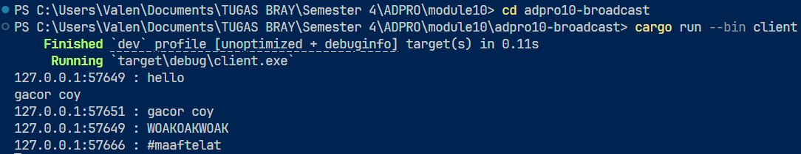

## 2.1 Original code, and how it run

### Server

### Clients

Ketika seorang klien mengirim pesan, server akan menjadi pihak pertama yang menerima pesan tersebut. Setelah itu, server akan mendistribusikan pesan tersebut ke semua klien yang sedang terhubung, termasuk si pengirim. Hal ini dimungkinkan karena server menyimpan daftar seluruh koneksi aktif dan terus memantau aktivitas mereka, sehingga saat ada pesan masuk, server dapat langsung menyebarkannya ke semua klien.

## 2.2: Modifying port

### Server

### Clients

Pada kasus tersebut tampak bahwa klien dan server menggunakan port yang berbeda. Server menunggu koneksi pada port 8080, sedangkan klien mencoba menghubungi websocket di port 2000. Karena tidak ada layanan websocket yang berjalan di port 2000, klien gagal terhubung dan muncul error ConnectionRefused. Ini menunjukkan bahwa klien telah mencoba membuat koneksi beberapa kali, namun selalu gagal. Untuk memperbaikinya dan memastikan aplikasi berjalan normal seperti sebelumnya, kode di client.rs perlu disesuaikan agar menggunakan port yang sama dengan server, yaitu mengganti ClientBuilder::from_uri(Uri::from_static("ws://127.0.0.1:2000")) menjadi menggunakan port 8080. Keduanya memang menggunakan protokol WebSocket, yang ditandai dengan prefix ws://. Ini menunjukkan bahwa klien mencoba membuka koneksi melalui WebSocket, bukan melalui koneksi TCP atau HTTP biasa.

## 2.3: Small changes, add IP and Port
Sebelumnya, server selalu menampilkan pesan lengkap dengan identitas klien pengirim. Ini dimungkinkan dengan sedikit penyesuaian pada kode di server.rs, khususnya di bagian yang mengatur penyebaran pesan ke semua klien. Semula, pesan dikirim menggunakan bcast_tx.send(text.into())?;, namun saya ubah menjadi bcast_tx.send(format!("{addr:?}: {text:?}"))?;. Dengan cara ini, setiap pesan yang dikirim oleh klien akan diteruskan oleh server ke seluruh klien lain, lengkap dengan informasi alamat IP dan port asal pengirim, sehingga setiap pesan lebih mudah dilacak sumbernya.